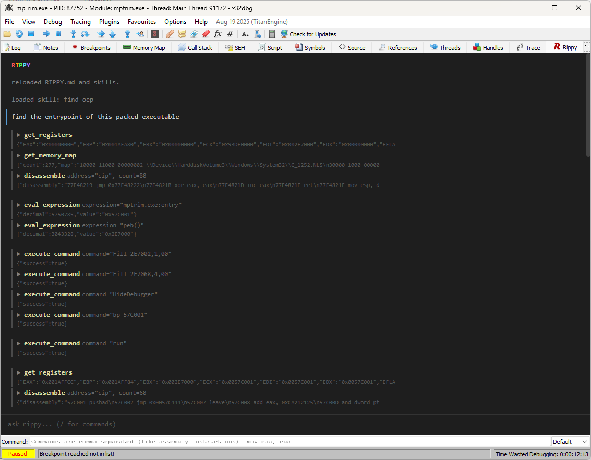

# Rippy

AI reverse engineering assistant for [x64dbg](https://x64dbg.com). Embeds a chat panel directly in the debugger with tool-use capabilities. The AI can read memory, disassemble, set breakpoints, step, and more.



## Installation

### 1. Prerequisites

- [x64dbg](https://x64dbg.com) (snapshot 2025-08-19 or newer)
- [WebView2 Runtime](https://developer.microsoft.com/en-us/microsoft-edge/webview2/) (usually already installed on Windows 10/11)
- An API key from [Anthropic](https://console.anthropic.com/) or an OpenAI-compatible provider

### 2. Download

Grab the latest release from the [Releases](https://github.com/dariushoule/x64dbg-rippy/releases) page. Download the zip for your architecture (x64 or x32).

### 3. Install

Extract the zip contents into your x64dbg plugins directory:

| Architecture | Directory |
|---|---|
| 64-bit | `x64dbg/release/x64/plugins/` |
| 32-bit | `x64dbg/release/x32/plugins/` |

You should have these files in the plugins folder:

```
x64dbg-rippy.dp64  (or .dp32)
libcrypto-3-x64.dll (or libcrypto-3.dll for x32)
libssl-3-x64.dll    (or libssl-3.dll for x32)
brotlicommon.dll
brotlidec.dll
WebView2Loader.dll
```

### 4. Configure

1. Launch x64dbg
2. Go to **Plugins → x64dbg-rippy → Settings...**
3. Select your API provider (Anthropic or OpenAI-compatible)
4. Enter your API key
5. Adjust endpoint/model if needed (defaults are sensible)
6. Click OK

The chat panel opens automatically. You can also toggle it via **Plugins → x64dbg-rippy → Show Chat**.

## Usage

Type a message in the chat input and press Enter. Load a target in x64dbg and rippy can inspect it using its built-in tools.

### Example prompts

- `what's at the current instruction pointer?`
- `read 64 bytes at rsp`
- `disassemble the entry point of ntdll`
- `set a breakpoint on CreateFileA`
- `what does this function do?` (with CIP inside a function)

### Slash commands

Type `/` to see the autocomplete menu.

| Command | Description |
|---|---|
| `/help` | Show available commands |
| `/clear` | Clear chat and start a new session |
| `/reload` | Reload RIPPY.md, skills, and start fresh |
| `/save` | Save conversation as markdown |
| `/skills` | List available skills |
| `/settings` | Open settings dialog |

### Skills

Skills are reusable prompts that guide rippy through complex tasks (e.g. finding an OEP in a packed binary). They live as markdown files in `.rippy/skills/` next to the x64dbg executable.

```
.rippy/
  RIPPY.md          # custom instructions (like CLAUDE.md)
  skills/
    find-oep.md     # loaded via /find-oep
  conversations/    # saved chats from /save
```

A skill file has frontmatter:

```markdown
---
name: find-oep
description: Find the Original Entry Point of a packed executable
command: find-oep
---

[skill prompt content here]
```

Load a skill by typing its slash command (e.g. `/find-oep`). The skill prompt is active until you `/clear`.

### RIPPY.md

Place a `RIPPY.md` file in the `.rippy/` directory to add persistent instructions to every conversation, similar to `CLAUDE.md` in Claude Code. Use it for project-specific context, preferred workflows, or custom rules.

## Tools

Rippy has these built-in tools that the AI uses automatically:

| Tool | Description |
|---|---|
| `eval_expression` | Evaluate x64dbg expressions (registers, math, symbols) |
| `read_memory` | Hex dump from debuggee memory |
| `disassemble` | Disassemble instructions at an address |
| `get_registers` | Dump all GP registers |
| `get_memory_map` | List memory regions |
| `get_symbol` | Get symbol/label at an address |
| `execute_command` | Run any x64dbg command |
| `get_command_help` | Search the x64dbg command reference |
| `read_file` | Read a file from disk (asks permission) |
| `list_directory` | List directory contents (asks permission) |

Most debugger actions (breakpoints, stepping, tracing, labels, etc.) go through `execute_command` using x64dbg's native command syntax. The AI has a built-in command reference and will look up syntax when unsure.

## Building from source

Requires Visual Studio 2022 with C++ workload and vcpkg integration. Assumes x64dbg is installed to `C:\re\x64dbg_dev\`.

```bash
# 64-bit: builds frontend + plugin, copies to install dir
build-install-64.cmd

# 32-bit
build-install-32.cmd
```

Frontend (Preact + esbuild):
```bash
cd frontend
npm install
npm run build
```

See [CLAUDE.md](CLAUDE.md) for detailed project structure and architecture.

## License

MIT
